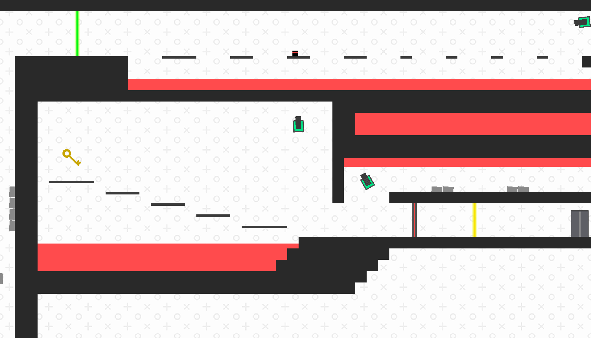
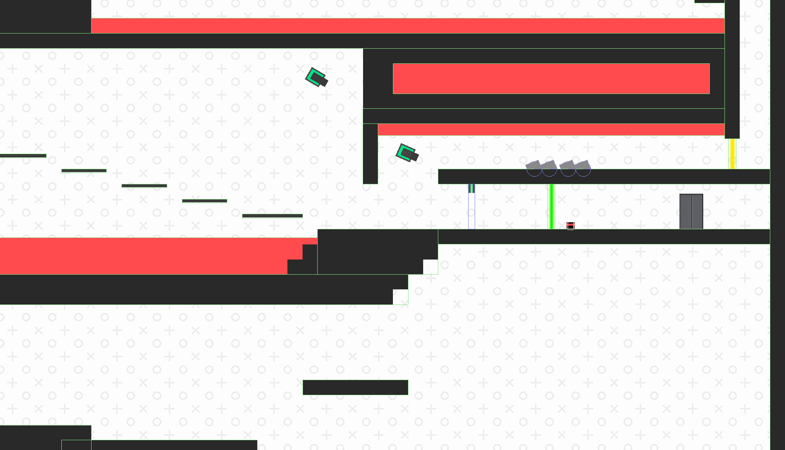

# Tower Heist
Tower Heist is an unfinished mini platformer game. It is inspired by "Big Tower Tiny Square"

The game is built with Java, using the LibGDX framework. Physics is handled with the Box2D library, and maps are created in the Tiled map format.

The game works on both desktop and browser (HTML5)

Unfortunately, due to circumstances that demanded my full focus (school), I have been forced to pause the development of this game. Perhaps one day I shall finish it...

## Screenshots

